# ATLAS - Autonomous Task Learning & Agent System

**A Production-Grade Autonomous Agentic AI Platform**

> *"Think of ATLAS as a junior-to-senior AI employee that can interpret ambiguous intent, plan strategies, execute tasks, learn from failures, and operate autonomously."*

[](https://www.python.org/downloads/)
[](https://opensource.org/licenses/MIT)
[](https://github.com/psf/black)

---

## 🎯 Mission

ATLAS is an **autonomous agentic AI system** that demonstrates absolute mastery of modern AI engineering. It's NOT a tutorial or demo—it's a **REAL, production-ready system** designed to:

- Interpret ambiguous human intent
- Plan multi-step strategies autonomously
- Spawn, coordinate, and terminate multiple agents
- Use tools, APIs, files, databases, and code
- Critique, repair, and improve its own outputs
- Persist memory across sessions
- Learn from successes and failures
- Operate continuously with minimal supervision

---

## 🏗️ Architecture

### System Overview

```mermaid
graph TB
    subgraph ATLAS["ATLAS SYSTEM"]
        subgraph Agents["Agent Layer"]
            Orchestrator["🎭 Orchestrator Agent"]
            Planner["📋 Planner Agent"]
            Executor["⚡ Executor Agent"]
            Critic["🔍 Critic Agent"]
            MemoryAgent["🧠 Memory Agent"]
            ToolAgent["🛠️ Tool Agent"]
            
            Orchestrator --> Planner
            Planner --> Executor
            Orchestrator --> Critic
            Orchestrator --> MemoryAgent
            Executor --> ToolAgent
        end
        
        subgraph Memory["MEMORY SYSTEMS"]
            ShortTerm["Short Term"]
            LongTerm["Long Term"]
            Episodic["Episodic Memory"]
            Semantic["Semantic Memory"]
        end
        
        subgraph Tools["TOOL LAYER"]
            Web["Web"]
            Files["Files"]
            Code["Code"]
            APIs["APIs"]
            Database["Database"]
            Shell["Shell"]
        end
        
        subgraph Obs["OBSERVABILITY"]
            Logging["Logging"]
            Tracing["Tracing"]
            Metrics["Metrics"]
            CostTracking["Cost Tracking"]
        end
        
        MemoryAgent --> Memory
        ToolAgent --> Tools
        Agents -.-> Obs
    end
```



### Agent Roles

1. **Orchestrator Agent** 🎭
   - Owns global execution graph
   - Coordinates agent interactions
   - Handles retries, failures, recovery

2. **Planner Agent** 📋
   - Converts goals into dependency graphs
   - Estimates cost, risk, complexity
   - Creates execution strategies

3. **Executor Agent** ⚡
   - Executes actions using tools
   - Writes, tests, debugs code
   - Handles tool orchestration

4. **Critic Agent** 🔍
   - Scores outputs for quality
   - Provides constructive feedback
   - Forces re-execution if needed

5. **Memory Agent** 🧠
   - Stores and retrieves experiences
   - Prevents repeated mistakes
   - Provides context for tasks

6. **Tool Agent** 🛠️
   - Secure tool execution
   - Permission management
   - Usage tracking

---

## 🚀 Quick Start

### Installation

```bash
# Clone repository
git clone https://github.com/Dnyanesh182/atlas.git
cd atlas

# Create virtual environment
python -m venv venv
source venv/bin/activate  # On Windows: venv\Scripts\activate

# Install dependencies
pip install -r requirements.txt

# Setup environment
cp .env.example .env
# Edit .env with your API keys
```

### Configuration

Edit `.env`:

```env
OPENAI_API_KEY=your-key-here
LLM_PROVIDER=openai
LLM_MODEL=gpt-4
ATLAS_ENV=development
```

### Basic Usage

```python
import asyncio
from atlas.system import AtlasSystem
from atlas.core.schemas import Task, Priority

async def main():
    # Initialize ATLAS
    atlas = AtlasSystem()
    await atlas.initialize()
    
    # Create task
    task = Task(
        description="Analyze the top 3 trends in AI for 2024",
        priority=Priority.HIGH
    )
    
    # Execute
    result = await atlas.execute_task(task)
    print(result)
    
    # Shutdown
    await atlas.shutdown()

asyncio.run(main())
```

### Run API Server

```bash
python examples/04_api_server.py
```

Access API docs at: `http://localhost:8000/docs`

---

## 📚 Features

### 🧠 Multi-Tier Memory System

- **Short-Term Memory**: Recent context (1 hour TTL, LRU eviction)
- **Long-Term Memory**: Persistent knowledge (vector-based, FAISS)
- **Episodic Memory**: Task execution history
- **Semantic Memory**: Facts and domain knowledge

### 🔧 Comprehensive Tool System

- **Web Tools**: Search, scraping, HTTP requests
- **File Tools**: Read, write, list (with permission controls)
- **Code Tools**: Python execution (sandboxed)
- **API Tools**: REST APIs, database queries
- **Shell Tools**: Command execution (strict allowlisting)

### 🎯 Autonomous Capabilities

- **Self-Planning**: Breaks down complex goals
- **Self-Execution**: Uses tools and code
- **Self-Critique**: Evaluates own outputs
- **Self-Improvement**: Learns from failures
- **Self-Recovery**: Automatic retry with exponential backoff

### 📊 Production Features

- **Structured Logging**: JSON logs with context
- **Distributed Tracing**: Full execution traces
- **Cost Tracking**: Token and $ cost per operation
- **Performance Metrics**: Real-time system stats
- **Streaming Responses**: SSE for real-time updates
- **API Authentication**: API key support

---

## 📖 Examples

### Example 1: AI CTO Analysis

```bash
python examples/01_ai_cto_analysis.py
```

Analyzes technology stack, architecture, security, and costs for a startup.

### Example 2: Competitor Research

```bash
python examples/02_competitor_research.py
```

Deep competitor analysis with market positioning and recommendations.

### Example 3: Multi-Agent Workflow

```bash
python examples/03_multi_agent_workflow.py
```

Complex multi-step workflow with agent coordination.

### Example 4: API Server

```bash
python examples/04_api_server.py
```

Run as production API server with FastAPI.

### Example 5: Memory & Learning

```bash
python examples/05_memory_learning.py
```

Demonstrates memory systems and learning from experience.

---

## 🔌 API Reference

### Create Task

```bash
POST /tasks
Content-Type: application/json
X-API-Key: your-api-key

{
  "description": "Your task description",
  "priority": "high",
  "max_retries": 3,
  "context": {}
}
```

### Get Task Status

```bash
GET /tasks/{task_id}
X-API-Key: your-api-key
```

### Stream Task Updates

```bash
GET /tasks/{task_id}/stream
X-API-Key: your-api-key
```

### System Status

```bash
GET /status
X-API-Key: your-api-key
```

---

## 🏗️ Project Structure

```
atlas/
├── atlas/
│   ├── core/                  # Core abstractions
│   │   ├── schemas.py         # Pydantic models
│   │   ├── base_agent.py      # Agent interface
│   │   ├── base_memory.py     # Memory interface
│   │   └── base_tool.py       # Tool interface
│   ├── agents/                # Agent implementations
│   │   ├── orchestrator.py    # Orchestrator agent
│   │   ├── planner.py         # Planning agent
│   │   ├── executor.py        # Execution agent
│   │   ├── critic.py          # Critic agent
│   │   ├── memory_agent.py    # Memory agent
│   │   └── tool_agent.py      # Tool agent
│   ├── memory/                # Memory systems
│   │   ├── short_term.py      # Short-term memory
│   │   ├── long_term.py       # Long-term memory
│   │   ├── episodic.py        # Episodic memory
│   │   ├── semantic.py        # Semantic memory
│   │   ├── vector_store.py    # Vector storage
│   │   └── manager.py         # Memory manager
│   ├── tools/                 # Tool implementations
│   │   ├── web_tools.py       # Web search, scraping
│   │   ├── file_tools.py      # File operations
│   │   ├── code_tools.py      # Code execution
│   │   └── api_tools.py       # API, database tools
│   ├── orchestration/         # LangGraph workflows
│   ├── api.py                 # FastAPI server
│   ├── system.py              # Main system
│   ├── config.py              # Configuration
│   └── observability.py       # Logging, tracing
├── examples/                  # Example scripts
├── tests/                     # Test suite
├── requirements.txt           # Dependencies
├── .env.example              # Environment template
└── README.md                 # This file
```

---

## ⚙️ Configuration

ATLAS is highly configurable via environment variables and config files:

```python
from atlas.config import AtlasConfig

config = AtlasConfig(
    llm=LLMConfig(
        provider="openai",
        model="gpt-4",
        temperature=0.7
    ),
    memory=MemoryConfig(
        persist_dir="data/memory",
        vector_store="faiss"
    ),
    tool=ToolConfig(
        enable_code_execution=False,  # Safety first
        enable_shell_execution=False
    )
)
```

---

## 🔒 Security

### Safe by Default

- Code execution **disabled** by default
- Shell commands require **explicit allowlisting**
- File operations restricted to **allowed paths**
- API authentication via **API keys**
- Input validation with **Pydantic v2**

### Production Deployment

```bash
# Use environment variables
export ATLAS_ENV=production
export TOOL_ENABLE_CODE_EXECUTION=false
export TOOL_ENABLE_SHELL_EXECUTION=false
export API_KEY=$(openssl rand -hex 32)

# Run with Gunicorn
gunicorn atlas.api:app \
  --workers 4 \
  --worker-class uvicorn.workers.UvicornWorker \
  --bind 0.0.0.0:8000
```

---

## 📊 Observability

### Structured Logging

```python
{
  "timestamp": "2024-02-04T10:30:00Z",
  "level": "INFO",
  "logger": "atlas",
  "message": "Task completed successfully",
  "task_id": "550e8400-e29b-41d4-a716-446655440000",
  "agent_type": "executor",
  "duration": 2.5,
  "cost": 0.0023
}
```

### Metrics Dashboard

Access real-time metrics:

```bash
GET /metrics
```

Returns:
- Task success rates
- Agent performance
- Memory usage
- Cost tracking
- Execution traces

---

## 🧪 Testing

```bash
# Run tests
pytest tests/ -v

# With coverage
pytest tests/ --cov=atlas --cov-report=html

# Run specific test
pytest tests/test_agents.py::test_planner_agent
```

---

## 🗺️ Roadmap

### Phase 1: Core (✅ Complete)
- [x] Multi-agent architecture
- [x] Memory systems
- [x] Tool framework
- [x] LangGraph orchestration
- [x] FastAPI server
- [x] Observability

### Phase 2: Enhancement (Q1 2026)
- [ ] Advanced RAG with citations
- [ ] Multi-modal support (images, audio)
- [ ] Agent communication protocols
- [ ] Distributed execution
- [ ] Web UI dashboard

### Phase 3: Scale (Q2 2026)
- [ ] Kubernetes deployment
- [ ] Horizontal scaling
- [ ] Load balancing
- [ ] Redis queue integration
- [ ] PostgreSQL storage

### Phase 4: Advanced (Q3 2026)
- [ ] Fine-tuned agents
- [ ] Reinforcement learning
- [ ] Human-in-the-loop
- [ ] Multi-tenant support
- [ ] Enterprise features

---

## 🤝 Contributing

We welcome contributions! See [CONTRIBUTING.md](CONTRIBUTING.md) for guidelines.

```bash
# Fork and clone
git clone https://github.com/Dnyanesh182/atlas.git

# Create branch
git checkout -b feature/amazing-feature

# Make changes and test
pytest tests/

# Commit and push
git commit -m "Add amazing feature"
git push origin feature/amazing-feature

# Open pull request
```

---

## 📄 License

MIT License - see [LICENSE](LICENSE) for details.

---

## 🙏 Acknowledgments

Built with:
- [LangChain](https://www.langchain.com/) - LLM framework
- [LangGraph](https://github.com/langchain-ai/langgraph) - Agent orchestration
- [FastAPI](https://fastapi.tiangolo.com/) - API framework
- [Pydantic](https://docs.pydantic.dev/) - Data validation
- [FAISS](https://faiss.ai/) - Vector search

---

## 💡 Philosophy

> "ATLAS was built by engineers who understand not just how AI works, but how it **fails** in production. Every design decision prioritizes reliability, observability, and production-readiness over clever demos."

### Design Principles

1. **Production First**: No prototypes—real, deployable code
2. **Observable**: Full logging, tracing, and metrics
3. **Safe**: Security and sandboxing by default
4. **Modular**: Clean architecture, SOLID principles
5. **Testable**: Comprehensive test coverage
6. **Scalable**: Designed for horizontal scaling

---

## 🎓 Learn More

- **Architecture Deep Dive**: [docs/architecture.md](docs/architecture.md)
- **Agent Design**: [docs/agents.md](docs/agents.md)
- **Memory Systems**: [docs/memory.md](docs/memory.md)
- **Tool Development**: [docs/tools.md](docs/tools.md)
- **Deployment Guide**: [docs/deployment.md](docs/deployment.md)

---

**Built with ❤️ by engineers who believe AI systems should be reliable, observable, and production-ready.**
